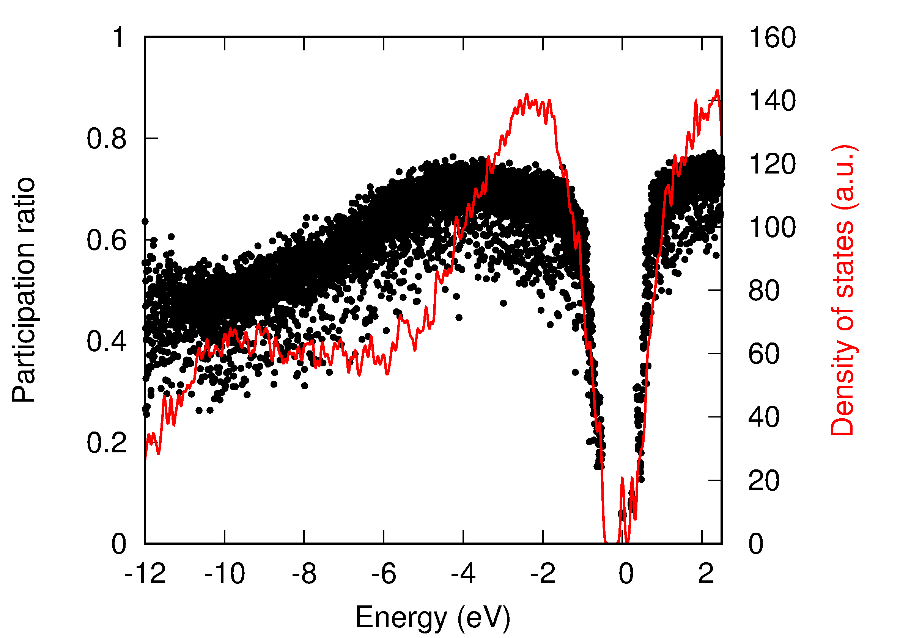

Calculates the participation ratio which is a measure of the wavefunction localisation.

# Installation

-input files: PROCAR
-the numbers in PROCAR are not amplitudes but squares of amplitudes !
 thus they are proportional to charge
-definition of participation ratio from 
 R.J.Bell and P. Dean, Localization of phonons in vitreous silica and related glasses
 in R.W.Douglas (ed.) Amorphous materials, p.443-451, 1972

-  p = M1*M1 / M0*M2
- now we think there is a typo in G. Kresse and J. Jafner, Phys. Rev. B 55, 7539 (1997)

# Example

